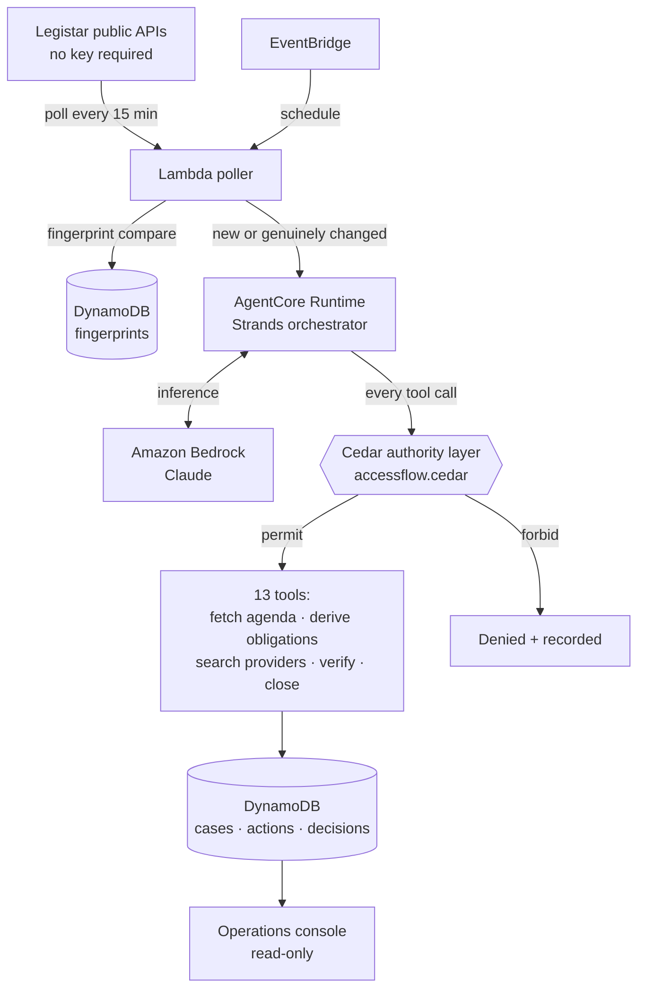

# AccessFlow

**An autonomous agent that watches real public meeting calendars, derives the accessibility
obligations each meeting carries under federal law, and coordinates them to a verified close —
without waiting for anyone to file a request.**

Built with the [Strands Agents SDK](https://github.com/strands-agents/harness-sdk), running on
Amazon Bedrock AgentCore Runtime, with a Cedar policy file as the agent's authority layer.

---

## The problem

When a city council meets, the law already requires that a deaf resident be able to follow it.
That obligation does not begin when someone asks. Under **28 CFR §35.160** — effective
communication — a public entity must furnish appropriate auxiliary aids for its public meetings.
That rule has been in force since **July 26, 1991**. There is no phase-in and no deadline to wait
for. It applies to the meeting happening next Tuesday.

In practice, coordination starts when a resident files a request, often days before the meeting,
sometimes after the deadline to book an interpreter has already passed. The obligation existed the
moment the meeting was scheduled. Nobody was tracking it.

Separately, **28 CFR Subpart H** (§35.200) requires that web content — including the agenda
document itself — conform to **WCAG 2.1 Level AA** by the entity's compliance date:

| Entity | Compliance date |
|---|---|
| Serving 50,000+ people | 2027-04-26 *(as extended, was 2026-04-24)* |
| Under 50,000 / special districts | 2028-04-26 *(as extended, was 2027-04-26)* |

Those dates come from an Interim Final Rule (FR 2026-07663) whose comment period is still open.

Two details matter, and are easy to get wrong:

- **§35.201(b) excepts documents that were available before the compliance date.** DOJ's own
  example of an excepted document is *"PDF minutes from past city council meetings."* An agenda
  posted today is excepted. AccessFlow derives the conformance obligation against the entity's
  compliance date, not against today.
- **Subpart H covers web content only.** Interpreters are not a Subpart H matter — they live in
  §35.160, which has been in force since 1991 and carries no deadline.

Conflating the two produces an agent that is confidently wrong about federal law. AccessFlow
derives them as two separate obligations with separate bases and separate deadlines.

## Who it is for

Accessibility coordinators and clerks at public bodies — the people who currently discover an
obligation when a request arrives, and who are measured on whether the meeting was accessible, not
on whether the paperwork was timely.

It is a **civic infrastructure** tool for the entity meeting its published obligations. It is not
a consumer product for disabled residents, and it does not accept or process individual
accommodation requests.

## What it does

1. **Polls real public meeting calendars** every 15 minutes via the Legistar public API — no key
   required, no scraping. 13 jurisdictions are configured — Seattle, Alameda, Oakland, San José,
   Long Beach, Mountain View, Denver, King County, Metro, San Mateo County, Santa Clara,
   Sacramento and Fresno.
2. **Detects genuine change**, not just new rows. It compares `EventLastModifiedUtc` and a content
   fingerprint of the agenda document, and re-runs the agent only on meetings that are new or that
   actually moved — a cancellation, a reschedule, an agenda replaced after first review. That
   comparison is what makes this an agent rather than a cron job.
3. **Derives obligations** for each meeting — the two above, with the statutory basis and deadline
   attached to each.
4. **Reads the agenda document** and infers which accommodations that specific agenda carries. A
   public hearing on a housing ordinance in a high-LEP district has a different profile from a
   procedural consent calendar. This is the part a rule engine cannot do.
5. **Coordinates providers**, escalates to a human when it cannot proceed, and **verifies
   fulfilment before closing** — an invariant enforced by policy, not by application code.

A case moves through: `NEW → COORDINATING → AWAITING_DECISION | AWAITING_PROVIDER → VERIFYING →
VERIFIED → CLOSED`, or `CANCELLED` if the meeting is called off.

## What is real and what is simulated

Stated plainly, because it matters for reading anything below.

| Real | Simulated |
|---|---|
| Meetings, bodies, dates, locations | The provider directory (7 seeded providers) |
| Agenda documents, fetched and parsed | Provider communication — no message reaches a real vendor |
| Cancellations and reschedules, as they happen | |
| The statutory obligations and their deadlines | |
| Every model call, tool call and policy decision | |

Real interpreter procurement cannot be wired up in a hackathon. The agent's *reasoning* about
providers is real; the providers are not. The interface labels every simulated interaction at the
point it happens.

## The authority model

The interesting part is not that the agent has rules. It is *where they live*.

Every tool call is checked against `policies/accessflow.cedar` before it executes. The model never
sees the policy and cannot route around it. A representative subset:

```cedar
// The core product invariant: a case cannot close without verified evidence.
// This is the one rule that, if it ever fails, makes the whole product a lie.
forbid(principal, action == Action::"close_case", resource)
unless {
  context has session &&
  context.session has verification_passed &&
  context.session.verification_passed == true &&
  context has input &&
  context.input has verification_id
};

// The agent cannot assert that a public body is non-compliant.
forbid(principal, action, resource)
when { context has input && context.input has asserts_noncompliance && context.input.asserts_noncompliance == true };

// The agent cannot publish anything externally.
forbid(principal, action, resource)
when { context has input && context.input has publishes_externally && context.input.publishes_externally == true };

// Any accessibility finding must carry an evidence id — recorded evidence, never a verdict.
forbid(principal, action == Action::"record_material_finding", resource)
unless { context has input && context.input has evidence_id };
```

That third-party judgment guard is deliberate. A tool that inspects government accessibility and
then declares a public body non-compliant is a liability, not a product. AccessFlow records
evidence with an id and a timestamp; a human draws the conclusion.

Provider requests are additionally capped at 25 calls per session and reminders at 10, enforced by
the same policy file rather than by a counter someone can forget to check.

## Architecture



The poller runs on Lambda, never inside AgentCore Runtime — continuous CPU there would cost more
than the entire project budget. AgentCore is invoked per case and bills only on active
consumption.

## Built with

- **Strands Agents SDK** (`strands-agents==1.53.0`) — one orchestrator with agents-as-tools
- **Amazon Bedrock AgentCore Runtime** — hosting, invoked per case
- **Amazon Bedrock** — Claude models for inference
- **Cedar** — the authority layer, via `strands-agents[cedar]`
- **DynamoDB** — cases, actions, decisions, fingerprints, and a hard daily spend cap
- **Lambda + EventBridge** — the 15-minute feed poller

---

## Quick start

> **Not yet written.** Setup instructions land once the persistence layer is verified end to end.
> This section must let a stranger get the project running cold before submission.

## Configuration

> **Not yet written.** Environment variables, table creation, IAM policy, provider seeding.

## Deployment

> **Not yet written.**

---

## Licence

MIT — see [LICENSE](LICENSE).
